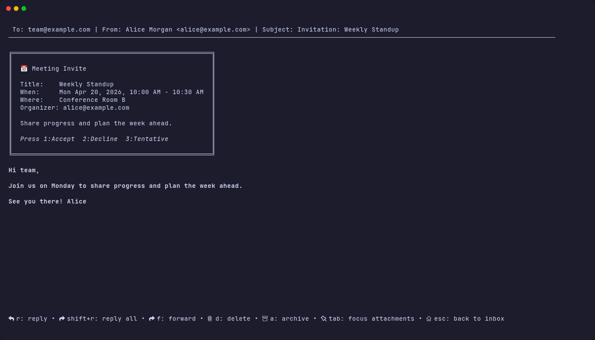

# Calendar Invites

Matcha can parse and display calendar invites (`.ics` attachments) directly in the email view, and lets you RSVP without leaving the terminal.

## Features

- **📅 Invite Detection**: Automatically detects `text/calendar` MIME parts and `.ics` attachments.
- **📋 Event Details Card**: Displays a styled card with the event title, date/time, location, and organizer.
- **✅ RSVP Support**: Accept, decline, or tentatively accept meeting invites with a single keypress.
- **📧 Standards-Compliant Replies**: Sends RFC 6047 (iMIP) compliant RSVP emails with proper `METHOD:REPLY` and `PARTSTAT` updates.
- **💾 Cache Persistence**: Calendar invite details are preserved when emails are cached for offline viewing.

## How It Works

When you open an email containing a calendar invite, Matcha parses the `.ics` data and renders an event card above the email body:

## Keybindings

| Key | Action |
|-----|--------|
| `1` | Accept the invite |
| `2` | Decline the invite |
| `3` | Tentatively accept the invite |

These keybindings are only active when a calendar invite is detected in the current email.

## RSVP Details

When you press an RSVP key, Matcha:

1. Generates a reply `.ics` file with your updated attendance status (`ACCEPTED`, `DECLINED`, or `TENTATIVE`).
2. Sends an email to the organizer containing:
   - A plain text body with the event summary and your response.
   - An inline `text/calendar; method=REPLY` part for calendar clients that process iMIP.
   - An `invite.ics` file attachment as a fallback.
3. Maintains email threading via `In-Reply-To` and `References` headers.

## Compatibility

RSVP replies follow the iMIP standard (RFC 6047) and are processed by most calendar systems:

| Calendar Provider | RSVP Processing |
|-------------------|-----------------|
| Microsoft Outlook / Exchange | ✅ Fully supported |
| Apple Calendar / Mail | ✅ Fully supported |
| Mozilla Thunderbird | ✅ Fully supported |
| Google Calendar | ⚠️ Limited — Google processes RSVPs through internal APIs rather than parsing incoming iMIP emails. Your reply will arrive as a regular email in the organizer's inbox but may not update your attendance status in Google Calendar. |

## Supported Formats

Matcha handles calendar invites delivered as:

- `text/calendar` MIME parts (inline calendar data).
- `.ics` file attachments (`application/ics`).
- Both `REQUEST` (new invite) and `CANCEL` (cancelled event) methods.

If an `.ics` file cannot be parsed, it falls back to being shown as a regular attachment.
